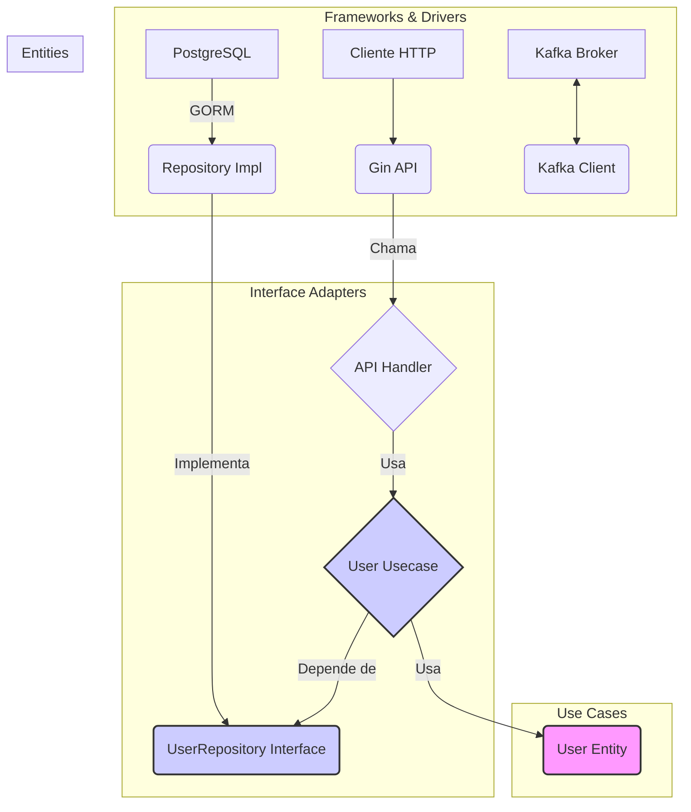

# ms-docsigner Brownfield Enhancement Architecture

## Padrões de Código e Convenções

Para manter a consistência e a qualidade, todos os projetos derivados deste template devem seguir os seguintes padrões:

- **Estrutura de Arquivos:** A estrutura de pastas baseada na Clean Architecture deve ser mantida. Novas funcionalidades devem ser adicionadas criando novos arquivos dentro das pastas existentes (ex: `usecase/new_entity/`) ou, se necessário, novas pastas que sigam a mesma lógica de separação.
- **Injeção de Dependência:** Todas as dependências devem ser inicializadas no `main.go` e injetadas nos construtores dos componentes. Nenhum componente deve criar suas próprias dependências.
- **Tratamento de Erros:** Os erros devem ser tratados na camada onde ocorrem. Erros de camadas mais internas devem ser propagados para as camadas externas, onde serão logados e convertidos em uma resposta apropriada (ex: um erro de banco de dados no repositório se torna um erro 500 na API).
- **Configuração:** Toda a configuração deve ser lida de variáveis de ambiente, conforme definido no `config/` e exemplificado no `.env.sample`.

## Estratégia de Testes

A arquitetura do template é projetada para ser altamente testável. A estratégia de testes se baseia em:

- **Testes Unitários:** A camada de `usecase` deve ter cobertura de testes unitários. Como ela depende de interfaces, as dependências (como repositórios) podem ser facilmente "mockadas" (simuladas). O diretório `mocks/` contém exemplos de mocks gerados para este fim.
- **Testes de Integração:** Testes de integração podem ser criados para testar o fluxo desde a camada de API até o banco de dados, utilizando um banco de dados de teste.
- **Framework de Teste:** O framework de testes padrão do Go (`testing`) é utilizado, complementado pela biblioteca `testify` para asserções mais ricas.

O template é estruturado em torno dos princípios da Clean Architecture, garantindo uma separação clara de responsabilidades e um fluxo de dependência que aponta para o interior. Isso resulta em um sistema de baixo acoplamento, alta coesão e excelente testabilidade.

### Componentes Principais

#### Entities
- **Responsabilidade:** Representar os objetos de negócio e as regras de negócio mais fundamentais. No template, a entidade `User` (`entity/entity_user.go`) serve como exemplo. Elas não têm conhecimento sobre como são persistidas ou apresentadas.
- **Dependências:** Nenhuma. É a camada mais interna e independente.

#### Use Cases
- **Responsabilidade:** Orquestrar o fluxo de dados de e para as entidades para executar as regras de negócio da aplicação. Por exemplo, `usecase/user/usecase_user_service.go` contém a lógica para criar um usuário. Esta camada define as *interfaces* que as camadas externas devem implementar (ex: `UserRepositoryInterface`), invertendo o controle da dependência.
- **Dependências:** Apenas da camada de Entities.

#### Interface Adapters
- **Responsabilidade:** Atuar como um conjunto de tradutores que convertem dados do formato mais conveniente para as camadas externas (como o banco de dados ou a web) para o formato mais conveniente para as camadas internas (use cases e entities), e vice-versa.
- **Componentes:**
    - **API Handlers (`api/handlers/`):** Recebem requisições HTTP do Gin, validam os dados e chamam o `usecase` apropriado. Eles traduzem os resultados do caso de uso em respostas HTTP.
    - **Repositories (`infrastructure/repository/`):** Implementam as interfaces de repositório definidas pelos `use cases`. São responsáveis por persistir e recuperar dados do banco de dados, traduzindo entre as entidades de negócio e os modelos do GORM.

#### Frameworks & Drivers
- **Responsabilidade:** A camada mais externa, composta pelas tecnologias e ferramentas. É onde tudo se junta.
- **Componentes:**
    - **`main.go`:** O ponto de entrada que inicializa e injeta todas as dependências.
    - **Gin Gonic (`api/api.go`):** O servidor web que direciona o tráfego para os handlers.
    - **PostgreSQL/GORM (`infrastructure/postgres/`):** O banco de dados e a biblioteca de acesso a ele.
    - **Kafka (`kafka/`):** O broker de mensageria.
    - **Docker:** A tecnologia de containerização.

### Diagrama de Interação de Componentes

This document outlines the architectural approach for `ms-docsigner`, which serves as a foundational template for new Go microservices. Its primary goal is to provide a guiding architectural blueprint for AI-driven development, ensuring seamless integration of new features within a well-defined, existing system.

### Existing Project Analysis

#### Current Project State
- **Primary Purpose:** To serve as a robust, reusable template for new Go microservices, implementing the Clean Architecture pattern.
- **Current Tech Stack:** Go (1.21), Gin, GORM, PostgreSQL, Confluent Kafka, Logrus, Docker.
- **Architecture Style:** A well-defined Clean Architecture, with clear separation of concerns between entities, use cases, interface adapters, and frameworks.
- **Deployment Method:** Containerized deployment using Docker.

#### Available Documentation
- A comprehensive analysis is available in `docs/project-analysis.md`.
- API documentation is auto-generated via Swaggo.

#### Identified Constraints
- The architecture is designed to be a template, so any additions must be generic or serve as clear, understandable examples.
- New dependencies should be added sparingly to keep the template lightweight.

### Change Log

| Change | Date | Version | Description | Author |
| :--- | :--- | :--- | :--- | :--- |
| Criação do Doc | 2025-07-18 | 1.0 | Versão inicial do documento de arquitetura. | @architect (Winston) |
